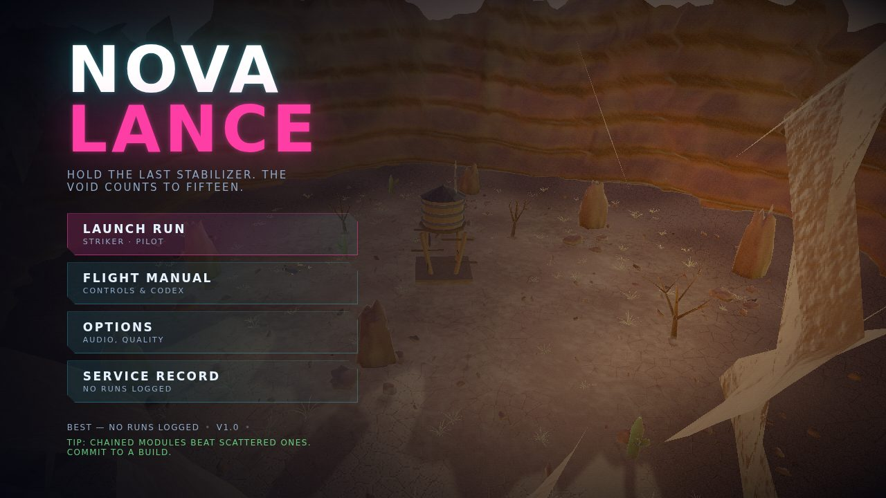
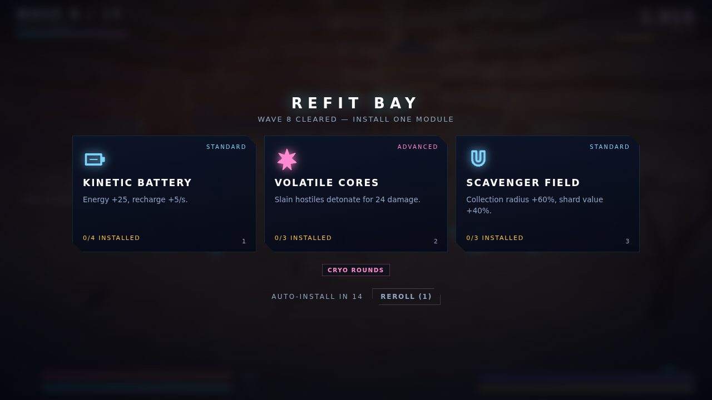
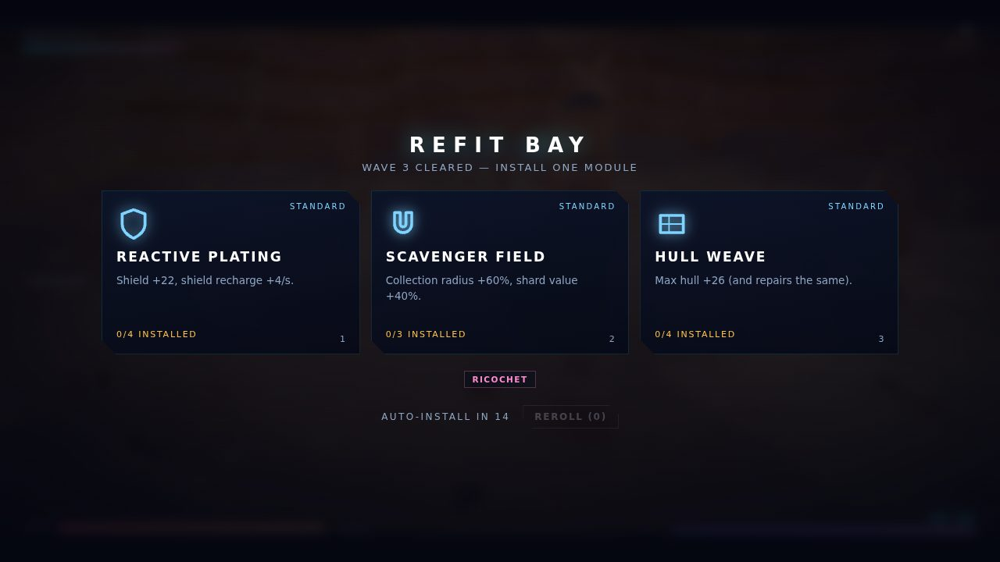

# NOVA LANCE

A complete 3D hover-combat arena roguelite that runs in a browser tab.
Fifteen waves, three boss encounters, twenty-six stackable modules, three
chassis — and **not one asset file**. Every mesh, texture, sound effect and
note of the soundtrack is generated in code at load time.



---

## Run it

```bash
npm start          # static dev server -> http://localhost:8080
```

Any static server works — the project has **zero runtime dependencies** and no
build step for development. Open `index.html` through a server (ES modules need
HTTP, not `file://`).

**Single file:** `dist/nova-lance.html` is the whole game in one HTML file
(three.js from cdnjs, everything else inline). Open it, host it, mail it.

```bash
npm run build      # regenerate dist/nova-lance.html
npm test           # 81-check automated playtest in headless Chromium
npm run test:artifact   # same suite against the host-wrapped build
npm run test:endurance  # long soak + deep Endless run
npm run balance         # scripted bot campaigns at every difficulty
npm run verify          # build, then boot-and-play all three builds (~20s)
```

## Controls

| Input | Action |
| --- | --- |
| `W A S D` / arrows / left stick | Thrusters |
| Mouse / right stick | Aim — the lance tracks your cursor |
| `LMB` / `RT` / right stick | Fire repeater |
| `RMB` / `E` / `X` | **Nova pulse** — radial blast that also deletes incoming bullets |
| `SPACE` / `SHIFT` / `RB` | **Phase dash** — invulnerable for the whole dash |
| `Q` / `F` / `Y` | **Overdrive** — when the meter is full |
| `ESC` / `P` / `Start` | Pause |
| `1` `2` `3` | Pick a module in the refit bay |
| `F1` | Performance readout |

Keyboard + mouse, gamepad (twin-stick with rumble) and touch (on-screen sticks)
are all first-class; the game switches between them automatically. Stick and
touch aiming get a modest magnetic assist inside a 17° cone — mouse aiming is
left alone, because it does not need help and stealing precision feels bad.

## The loop

1. **Fight a wave.** Hostiles arrive through telegraphed rifts in groups. Kill
   them all to clear the wave.
2. **Refit.** Draft one of three modules. They stack, and the draft biases
   toward what you already own so builds converge instead of scattering.
3. **Escalate.** Waves 5, 10 and 15 are bosses. Everything else gets tougher,
   faster and more numerous on a curve tuned against bot playtests.
4. **Bank the combo.** Kills chain a multiplier; taking damage cuts it. Shards
   and kills fill Overdrive, a six-second window of doubled cadence and an
   damage aura that turns a losing fight around.
5. **Win or die**, get ranked, unlock the next chassis, run it again.



## What is in the box

**Six enemy archetypes**, each attacking a different player habit:

| | Threat |
| --- | --- |
| **Skitter** | Swarm rusher. Lunges and detonates — punishes standing still. |
| **Drone** | Standoff gunnery. Orbits at range and chips — punishes passivity. |
| **Splitter** | Breaks into two Skitters on death — punishes greedy clears. |
| **Seeder** | Lobs mortars at where you are *going* — punishes camping. |
| **Lancer** | Winds up, then crosses the deck — punishes tunnel vision. |
| **Sentinel** | Paints a line, then deletes it — punishes lazy positioning. |

**Three bosses** with phase ladders, telegraphed attack scripts and distinct
mechanics — the Warden (orbital plates, spiral fire, arena slam), the Harrower
(sweeping beams, charge runs, minefields) and the Void Maw (jaw shockwaves,
void zones, a vacuum phase that exposes its eye as a weak point).

**Real skeletal animation.** Every enemy and chassis is a rigged model with
authored clips, not a spinning mesh: Skitters scuttle on four articulated legs
and crouch before a lunge, Sentinels stride on a tripod gait and brace before
firing, Lancers pump their legs into a charge, Seeder barrels recoil in
sequence, ship wings fold back on a dash. Hits produce a flinch away from the
impact; death drives a limp collapse through the rig.

**Cinematics.** Deployment opens on a wide sweep while the hull materialises;
each boss arrives on a letterboxed low-angle push-in anchored to its live
position; victory rises off the deck and defeat pushes in on the wreck. Every
intro is skippable on any input.

**Twenty-six modules** across three rarities: multishot, ricochet, pierce,
chain lightning, seekers, lifesteal, volatile cores, guardian drones, time
dilation on dash, siphon pulses, and more. Everything stacks and recomputes
from base stats, so no combination can desync.

**Three chassis** — Striker (balanced), Bastion (slow brick, wide pulse),
Phantom (three dashes, glass) — unlocked by reaching waves 5 and 10.
**Three threat levels** and an **Endless** mission unlocked by winning.



## Everything is procedural

| Asset | How it is made |
| --- | --- |
| Meshes | `MeshBuilder` composes primitives into one merged non-indexed geometry per model, carrying per-vertex colour and emissive attributes. One draw call per entity. |
| Rigs | `RigBuilder` does the same but assigns each part to a bone and emits an `aBone` attribute, so an articulated model is still one draw call. |
| Animation | Clips are authored in code as position/rotation/scale tracks, compiled against a skeleton, then crossfaded by a small animator with procedural overlays on top. |
| Terrain | Landforms, not stacked primitives: a dense icosphere or polar grid displaced by multi-octave value noise, sliced against fracture planes for an angular silhouette, stepped along bedding planes, then shaded with strata and baked cavity occlusion in vertex colour. |
| Surface detail | Below the size of a triangle, relief comes from the normal: a triplanar height field turned into a shading normal by Mikkelsen's derivative bump, so untextured rock still reads up close with no UVs and no tangents. |
| Ground | Displaced polar mesh under a fragment shader that adds Worley F2-F1 crazing in dried clay, patchy so it never covers the basin evenly, plus eight live impact ripples. |
| Sky | An equirectangular nebula painted once into a canvas: fbm cloud layers sampled on a circle (so it tiles), three star populations, cross flares. |
| Particles | Canvas-painted glow/smoke/shard sprites over a data-oriented `Points` system — one draw call per blend mode. |
| Sound | WebAudio synthesis: oscillators, filtered noise bursts and a procedural convolution reverb. Thirty-six distinct effects. |
| Music | A generative sequencer — drums, bass, arp and pads over a D-minor progression — whose layers, tempo and filter cutoffs follow combat intensity. |

The mix was balanced by measurement rather than by ear: `node tools/audiomix.mjs`
renders every effect through an `OfflineAudioContext` and prints peak, RMS and
audible duration, which is how three effectively-silent cues and an
enemy-louder-than-you imbalance were found and fixed.

## Architecture

```
index.html            markup + HUD/menu skeleton
src/
  main.js             bootstrap, WebGL/asset failure handling, debug surface
  game.js             state machine, frame loop, damage/score/explosion rules
  core/
    util.js           math, seeded RNG, object pools, rolling statistics
    input.js          keyboard+mouse / gamepad / touch -> one intent surface
    audio.js          synthesis engine + generative soundtrack
    save.js           settings and career record (storage-failure tolerant)
  render/
    renderer.js       WebGL setup + hand-written bloom & composite passes
    materials.js      the shader family (surface, floor, energy, particles…)
    rig.js            rigid-bind skinning, clips, crossfading animator
    models.js         static meshes (props, projectiles, pickups)
    terrain.js        landform geometry: displaced rock, ground, canyon
    rig-models.js     the animated cast: ships, six archetypes, three bosses
    textures.js       every texture in the game
    world.js          arena assembly
    camera.js         chase rig with two-target boss framing
    particles.js      GPU particle systems + named effects
    vfx.js            rings, beams, telegraphs, debris, blob shadows, screen FX
  entities/           player, enemies + AI, projectiles, pickups, bosses
  systems/            ships, upgrade catalogue, wave director, cinematics
  ui/                 screens, HUD, feedback, stylesheet
tools/
  serve.js            zero-dep dev server
  build.js            zero-dep bundler -> dist/nova-lance.html
  playtest.mjs        automated QA suite (81 checks)
  verify-bundle.mjs   fast boot-and-play gate for all three builds
  endurance.mjs       long soak + deep Endless run (leak/drift detection)
  balance.mjs         scripted bot campaigns for tuning
  audiomix.mjs        offline render of every effect: peak / RMS / duration
  visual.mjs          staged scene capture for art review
  rigview.mjs         isolated contact sheets of any animation clip
  check.mjs           syntax check across all modules
```

Rendering is a bespoke pipeline because three.js's UMD build ships no
post-processing addons: the scene renders into an HDR target, a bright pass
feeds two blur levels, and one composite pass does bloom, ACES tone mapping,
sRGB encode, vignette, chromatic aberration, grain and the overdrive grade.

That pipeline degrades rather than fails. Plenty of phones expose WebGL2 without
being able to *render* to RGBA16F, so the HDR path is earned at boot — check the
extension, then make the driver prove it with a real framebuffer — and every
allocation is re-checked for completeness. If frames still come back black, a
watchdog reads the canvas back and steps down: HDR targets, then plain 8-bit
targets, then straight to the canvas with the shaders tone mapping on their own.
A duller frame beats a black one.

The camera offers three rigs, because the viewing angle decides what kind of
game this is. **POV** (the default) is over-the-shoulder — low, close, and it
swings round behind the ship as you turn, so the deck has real depth and the
horizon is in frame. It follows a facing only when you are aiming with a stick
or a thumb: an absolute mouse cursor's ground point rotates *with* the camera,
so a rig that chased it would spin forever, and with a cursor the rig stays
world-locked instead. **Chase** keeps that low framing but never turns, so north
is always up the screen. **Tactical** is the old high board view. Directional
input is rotated into world space against the camera basis, so "forward" means
wherever you are looking; the scripted test channel deliberately bypasses that
and stays world-space. Horizontal field of view is capped at 96 degrees, because
a 70-degree vertical rig on a 21:9 phone is otherwise a 113-degree fisheye.

Animation is bespoke for a related reason: three's skinning path needs GLSL3
`texelFetch`, which would drag the whole shader family to ES 3.00. These models
are hard-surface robots where every vertex belongs to exactly one bone, so
`rig.js` implements a leaner rigid bind — one `aBone` attribute and a small
mat4 uniform array — preserving one draw call per entity in GLSL1.

## Performance

Everything that spawns during play is pooled — projectiles, enemies, particles,
rings, decals, beams, debris, pickups and even the floating damage numbers.
A frame at wave 15 with a boss on screen costs **~61 draw calls** — rigging the
entire cast added none, because a skeleton does not split a mesh — and the
simulation runs in well under a millisecond of CPU. Quality auto-tunes down a
tier if the 90th-percentile frame time stays over budget.

Twelve simulated minutes of continuous heavy combat (`npm run test:endurance`)
move nothing: geometries, textures, scene-graph size, DOM node count and JS
heap all plateau early and stay flat.

## Testing

`npm test` boots the real game in headless Chromium and drives it through the
same input path a human uses:

- boot, every menu screen, and a scripted wave-1 fight
- all three boss encounters
- all 26 modules installed at once, checked for NaN
- refit draft, reroll, card pick, and the resume path
- pause/resume spam, death → results, boss kill → victory
- **a complete 15-wave campaign played end to end by a bot**
- resource-leak checks across 12 restarts (geometries, textures, DOM, scene graph)
- touch end to end: real pointer drags on both sticks, taps on every action button
- aim-assist cone behaviour
- every rig: builds, stays under the bone limit, produces finite poses across
  every clip and every crossfade, and each clip demonstrably moves the skeleton
- cinematics: lock and release input, survive a skip, and survive a pause
- abuse passes: restart/dash/pulse/overdrive spam, wave 60, pickup floods,
  quality switching, viewport storms
- resilience: corrupt save payload, storage denied, WebGL context loss and
  restore, pool saturation, hostile delta times, a 320x480 viewport
- audio: all 36 effects and the music scheduler, plus an offline render of
  every effect asserting it is audible and does not clip the master bus
- performance and draw-call budgets

`node tools/balance.mjs` runs bot campaigns at every difficulty and prints
wave-by-wave clear times, which is how the pacing above was tuned.

`npm run verify` is the publish gate. The module build and the single-file
bundle can diverge — the bundler strips imports, so anything import-shaped that
survives into a name is a hazard — and a bundle-only crash has shipped once.
It builds, then boots *and plays* all three builds in about twenty seconds.

## Known limitations

- Bloom is a two-level Gaussian rather than a proper mip pyramid; on very wide
  displays the largest halos are slightly blocky at the Low quality tier.
- Animation blends interpolate Euler angles rather than quaternions. That is
  fine for the ranges these clips use, but a clip authored with a rotation past
  180 degrees on one axis would take the short way round and look wrong.
- Death collapses are a procedural overlay rather than authored death clips, so
  every archetype crumples in a broadly similar way.
- The soundtrack is generative, not composed — it never resolves to a chorus.
- The audio mix is verified numerically (levels, clipping, duration) but has
  never been listened to on speakers; timbre judgements are inferred from the
  synthesis, not heard.
- Enemies path around obstacles by steering and separation, not a navmesh, so a
  Lancer occasionally clips a pillar corner during a charge (it stuns, which is
  the intended punish, but the collision reads as slightly abrupt).
- Touch play works and is tested, but the arena is genuinely harder on a phone
  than with a mouse even with aim assist; the camera does not compensate.
- Endless runs past roughly wave 25 lean on boss HP rather than new behaviour —
  the encounters stop gaining mechanics after the third cycle.
- Career progress lives in `localStorage`; private-mode browsers report this in
  Options and the run still plays normally.

## Licence

MIT. Built with [three.js](https://threejs.org) (MIT).
